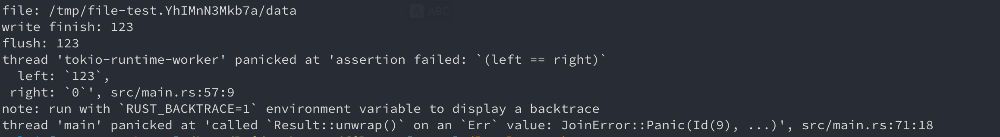

# Tokio file visibility problem MRE

This is a minimal reproducible example(MRE) that demonstrates a file visibility issue
in [tokio-fs](https://docs.rs/tokio/0.1.22/tokio/fs/index.html)

## What does this program do

In `src/main.rs`, 3 async tasks cooperate with each other, synchronized by `tokio::sync::Notify`.

- Writer appends data to the end of file, update `write_offset` and notify flush task.
- Flush task waits for write finishes, load `write_offset`, flush file and update `flush_offset` to `write_offset`.
- Reader waits for flush finishes, load `flush_offset` as the persisted file length, read the file
  region `[0, flush_offset)` and checks if data read matches data written.

## What is expected

As these async tasks are carefully synchronized, when reader initiates a read to file,
it should be able to see the data written by writer is already persisted, the file's length
in file metadata is equal to `flush_offset`, and the file content is the same as data written.

## What actually happens

When run this program in a loop, given enough time to repeat, it can always panic at the assert statement in reader
task,
complaining that file's length in metadata is 0, and file content read is empty.

```bash
$ cargo build

$ while ./target/debug/filemap; do echo ; done
# ... many runs

file: /tmp/file-test.YhIMnN3Mkb7a/data
write finish: 123
flush: 123
thread 'tokio-runtime-worker' panicked at 'assertion failed: `(left == right)`
  left: `123`,
 right: `0`', src/main.rs:57:9
note: run with `RUST_BACKTRACE=1` environment variable to display a backtrace
thread 'main' panicked at 'called `Result::unwrap()` on an `Err` value: JoinError::Panic(Id(9), ...)', src/main.rs:71:18

```



From above logs, it's clear that `sync_all` succeeded before read (as we can see "flush: 123" was printed),
even though when reader read file it could only see an empty file.

The problem can always be reproduced in platform:

```bash
$ uname -a
Linux VM-16-12-ubuntu 5.4.0-77-generic #86-Ubuntu SMP Thu Jun 17 02:35:03 UTC 2021 x86_64 x86_64 x86_64 GNU/Linux

$ rustup show
Default host: x86_64-unknown-linux-gnu

installed toolchains
--------------------

stable-x86_64-unknown-linux-gnu
nightly-x86_64-unknown-linux-gnu (default)

active toolchain
----------------

nightly-x86_64-unknown-linux-gnu (default)
rustc 1.64.0-nightly (830880640 2022-06-28)
```

But interestingly, this problem could not yet be reproduced in ARM platforms, including Raspberry Pi and Macbook Pro M1.
